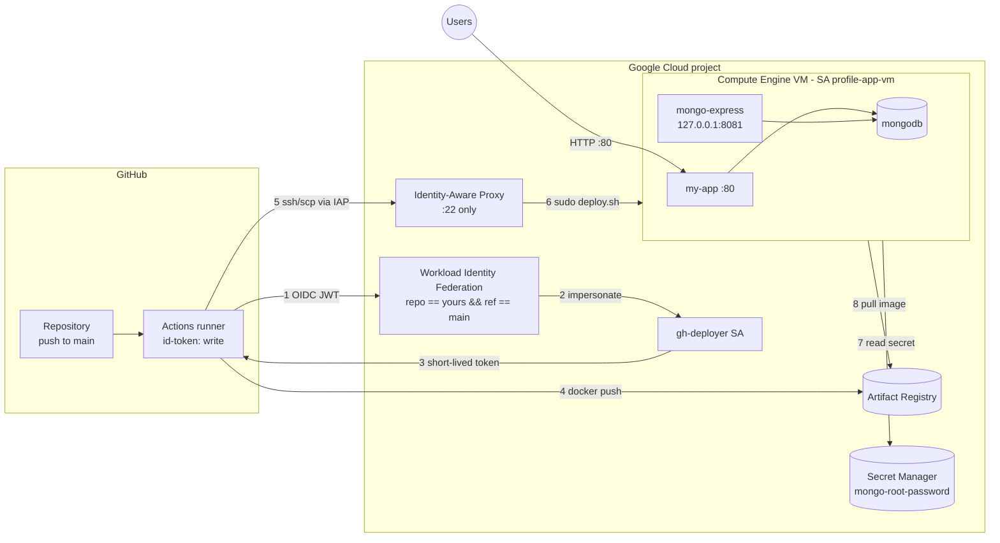

# Profile app on a GCE VM (GitHub Actions + OIDC)

Node.js + MongoDB app deployed to a single Compute Engine VM with Docker Compose.
GitHub Actions authenticates to Google Cloud with **Workload Identity Federation (OIDC)**:
no service-account JSON key and no SSH key are stored in GitHub.



## Layout

| Path | What it is |
|---|---|
| `.github/workflows/deploy-gce.yml` | Build → push to Artifact Registry → deploy over IAP SSH → smoke test |
| `infra/bootstrap.sh` | One-time GCP setup: APIs, Artifact Registry, WIF pool/provider, service accounts + IAM, secret, firewall, static IP, VM |
| `infra/vm-startup.sh` | VM startup script that installs Docker + compose plugin |
| `deploy/docker-compose.yml` | What runs on the VM (`/opt/profile-app`) |
| `deploy/deploy.sh` | Runs on the VM: writes `.env` from Secret Manager, pulls, `compose up`, health check |

## Setup (once)

1. Push this folder to a GitHub repo.
2. In Cloud Shell (as a project Owner), from the repo root:
   ```bash
   PROJECT_ID=your-project GITHUB_REPO=your-user/your-repo ./infra/bootstrap.sh
   ```
3. Copy the variables it prints into **Settings → Secrets and variables → Actions → Variables**
   (or run the `gh variable set` lines it prints).
4. Push to `main` (or run the workflow manually). The job summary shows the app URL.

## Networking

| Resource | Name | Settings |
|---|---|---|
| VPC | `profile-app-vpc` | custom subnet mode (no default-network open rules) |
| Subnet | `profile-app-subnet` | `10.10.0.0/24`, `us-east1`, Private Google Access on |
| Firewall | `profile-app-allow-http` | ingress `tcp:80` from `0.0.0.0/0` → VM service account |
| Firewall | `profile-app-allow-iap-ssh` | ingress `tcp:22` from `35.235.240.0/20` (IAP) → VM service account |
| Firewall | implied | deny all other ingress, allow all egress |
| Address | `profile-app-vm-ip` | regional static external IP on nic0; VM internal IP `10.10.0.10` |

Ports 3000, 8081 and 27017 are never exposed: Docker only publishes host `:80 → my-app:3000`,
MongoDB stays on the compose bridge network, and mongo-express binds to `127.0.0.1`.

## Operating

- mongo-express is bound to the VM's localhost. To open it:
  `gcloud compute ssh profile-app-vm --zone us-east1-b --tunnel-through-iap -- -L 8081:localhost:8081`
  then browse to http://localhost:8081 (user `admin`, password from Secret Manager).
- Roll back: re-run an older workflow run, or on the VM set `APP_IMAGE` in `/opt/profile-app/.env` to an older tag and `docker compose up -d`.
- The Mongo root password is only applied when the `mongo-data` volume is first created. Changing the secret later requires changing the user inside Mongo as well.
